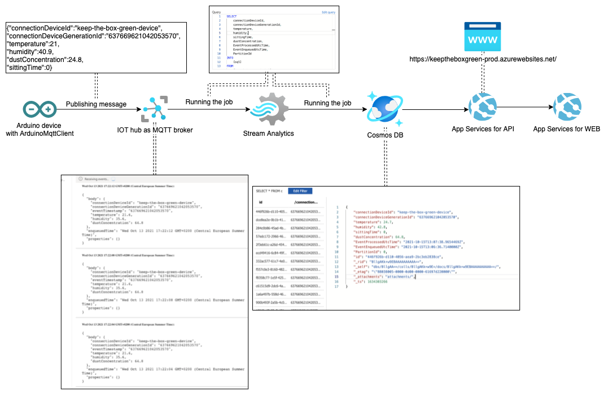

### Table of contents

- [Project Description](#project-description)
- [Data Flow](#data-flow)
- [Local Installation](#local-installation)
- [Schematics & blueprint](#schematics-and-blueprint)
- [Hardware Components](#hardware-components)

### Project Description

The main goal is to build an Arduino device, which is going to collect data from different sensors. It has simple logic behind which helps to indicate if any working conditions are violated by changing the colour of a box #keepTheBoxGreen. For example when a person is sitting in front of the laptop for more than 1 hour or air quality has dropped too much, the light of the box will change its colour to red and LCD display will print an appropriate advice. 

This repo consists of code for Arduino MKR1010 board.

API implementation repo: [link to api repo](https://github.com/some-otter-thing/keepTheBoxGreen-api) 

WEB implementation repo: [link to web repo](https://github.com/some-otter-thing/keepTheBoxGreen-fe) 

### Data Flow
The board uses Azure cloud provider for publishing and storing data.


### Local Installation:

1. Create a header file within Main folder

```
touch arduino_secrets.h
```

2. Add information about wifi:

```
#define SECRET_SSID "here is network name"
#define SECRET_PASS "here is the password of wifi"
#define SECRET_BROKER    ""
#define SECRET_DEVICE_ID ""
```
3. You need to have following libraries installed:

   1. Wifi:
      - WiFiNINA library
   2. MQTT connection:
      - ArduinoMqttClient
      - ArduinoBearSSL
      - ArduinoECCX08
      - ArduinoJson
   3. TFT Display
      - Adafruit BusIO 
      - Adafruit_GFX
      - Adafruit_ST7735 & ST7798
   4. DHT22
      - Adafruit DHT sensor library
   5. LED
      - FastLED
   6. Dust Sensor
      - Nova Fitness SDS dust sensors library
### Guides:

- Connecting to wifi - <a href="https://www.arduino.cc/en/Guide/MKRWiFi1010/connecting-to-wifi-network">link</a>

- Explanation of necessary drivers for the Arduino MKR1000 series of boards - <a href="https://www.arduino.cc/en/Guide/MKR1000">link</a>

- Helper to make json https://arduinojson.org/v6/assistant/

### Schematics and blueprint

- Use [fritzing](https://fritzing.org/) to open the file in assets folder
- Need to sign up if you don't want to pay for it..

### Hardware Components:

1. Arduino MKR 1010 Board
2. DHT22 Sensor
3. HC-SR0 4Ultrasonic Sensor
4. Generic LED Strip
5. Generic 1.8" TFT Display
6. Nova PM SDS011 PM 2.5 sensor


